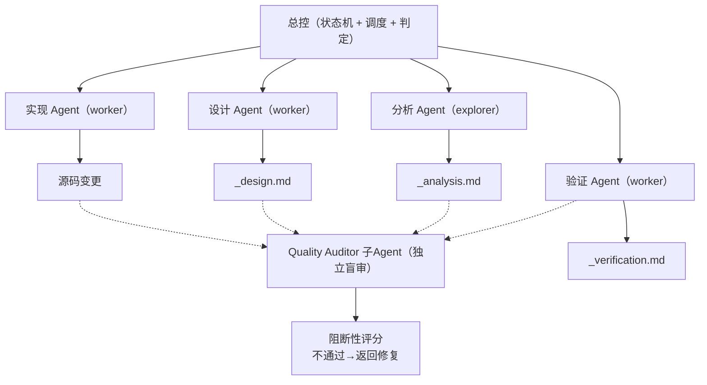
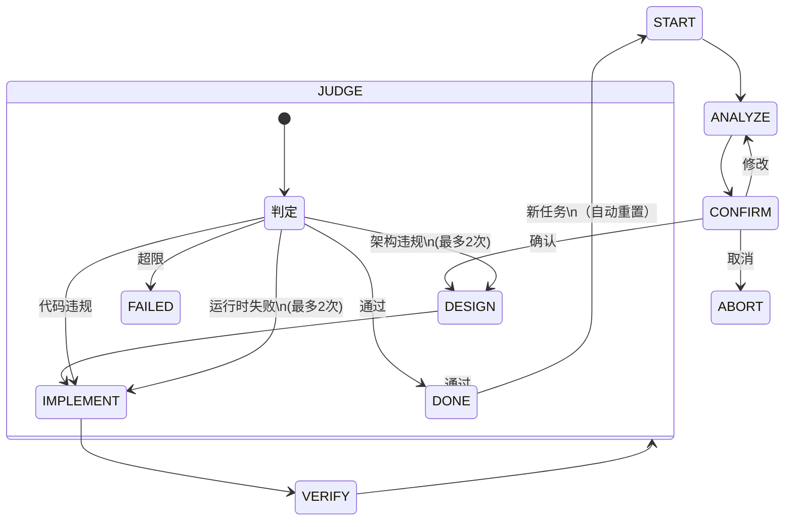

# ReqPlan-v3 — Harness Engineering 项目全生命周期管理引擎

> 基于 Harness Engineering 理念 + 接力棒持久化机制，覆盖项目从需求分析到最终判定的全流程。

---

## 核心特色

- **7 阶段状态机**：START → ANALYZE → CONFIRM → DESIGN → IMPLEMENT → VERIFY → JUDGE → DONE，自动推进 + 用户确认点
- **多 Agent 协作**：Analyzer / Designer / Implementer / Verifier / Quality Auditor 各司其职，通过文件契约传递产物
- **接力棒持久化**：`.agent/harness/_baton.md` 记录状态、进度、产物清单，支持跨 Session 续跑
- **五层验证体系**：静态检查 → 单元测试 → 构建集成 → 异常处理 → 流程合规
- **独立质量审核**：每个阶段由 Quality Auditor 子Agent 独立盲审，审核不通过阻断流程
- **用户中断处理**：任何阶段用户中途介入，支持立即重置 / 记入TODO / 仅讨论三选项
- **自绑定审查**：支持审查和修复 Skill 自身，遵守与普通任务相同的状态机规则

---

## 快速开始

### 首次使用

```bash
/reqplan start     # 启动引导，选择流程
/reqplan init      # 初始化 .agent/harness/ 目录
```

### 续跑（中断后继续）

```bash
/reqplan start     # 自动读取接力棒，恢复进度
```

---

## 核心流程

| # | 流程 | 适用场景 |
|---|------|----------|
| 1 | 完整项目流程 | 新项目启动，从需求到验收 |
| 2 | 需求迭代流程 | 已有项目的需求更新和迭代 |
| 3 | 设计评审流程 | 架构设计、接口定义、数据库设计 |
| 4 | 代码开发流程 | 代码实现、Bug 修复、功能开发 |
| 5 | 测试优化流程 | 测试策略制定、用例设计、覆盖提升 |
| 6 | 文档完善流程 | 技术文档、API 文档的补充 |
| 7 | 架构重构流程 | 架构优化、技术债务清理 |
| 8 | 自绑定审查流程 | 审查/修复 Skill 自身（元任务） |

---

## 多 Agent 协作



协作流程：
1. 总控读取接力棒确定当前状态
2. 按状态路由表调度对应的 Agent
3. Agent 读取前置产物，生成当前阶段产物
4. Quality Auditor 审核产物，通过后才能进入下一阶段
5. 总控更新接力棒，自动推进到下一阶段

---

## 状态机



| 状态 | 推进方式 | 关键检查点 |
|------|---------|-----------|
| START | 自动 | 创建接力棒 |
| ANALYZE | 自动 | 质量审核阻断 |
| CONFIRM | 等待用户 | 用户确认/修改/取消 |
| DESIGN | 自动 | 质量审核阻断 |
| IMPLEMENT | 自动 | 质量审核阻断 |
| VERIFY | 自动 | 独立盲审阻断 |
| JUDGE | 自动 | 六维度最终判定 |
| DONE | 终止 | 新任务自动重置为 START |

---

## 产物结构

```
{项目路径}/.agent/harness/
├── _baton.md                     # 接力棒（状态 + 进度 + 任务追踪）
├── _analysis.md                  # 需求分析报告
├── _design.md                    # 技术设计文档
├── _implementation.md            # 实现摘要
├── _verification.md              # 验证报告
├── _quality_audit_analysis.md    # 分析质量审核报告
├── _quality_audit_design.md      # 设计质量审核报告
├── _quality_audit_implement.md   # 实现质量审核报告
├── _quality_audit_verify.md      # 验证质量审核报告
└── _quality_audit_judge.md       # 最终全局判定报告
```

---

## 五层验证体系

| 层级 | 验证内容 | 说明 |
|------|----------|------|
| Layer 1 | 静态检查 | 代码规范、类型检查、文件完整性 |
| Layer 2 | 单元测试 | 核心函数正确性、边界条件、错误路径 |
| Layer 3 | 构建集成 | 编译检查、依赖安装、构建输出 |
| Layer 4 | 异常处理 | 失败重试、回滚策略、降级行为 |
| Layer 5 | 流程合规 | 链路记录、决策日志、约束登记 |

---

## 目录结构

```
ReqPlan-v3/
├── SKILL.md                   # 技能入口（唯一版本声明源）
├── SKILL-execution.md         # 核心执行指南
├── README.md                  # 本文件
├── agents/                    # Agent 定义
│   ├── analyzer-agent.md     # 分析 Agent
│   ├── designer-agent.md     # 设计 Agent
│   ├── implementer-agent.md  # 实现 Agent
│   ├── verifier-agent.md     # 验证 Agent
│   └── quality-auditor-agent.md # 质量审核 Agent
├── quality-control/           # 质量体系
│   └── 00-quality-system.md  # 质量审核体系定义
├── protocols/                 # 协议文档
│   └── baton-protocol.md     # 接力棒协议
├── artifacts/                 # 产物模板
│   └── template-artifacts.md # 产物模板集合
├── SKILL.chunks/              # 分块加载（按需激活）
├── legacy/                    # 历史归档
├── reference/                 # 参考文档
└── 6-docs/                    # 版本变更日志
    └── changelog.md
```

---

## 设计理念

### Harness Engineering

1. **角色边界** — 每个 Agent 只做一件事，职责单一
2. **状态机驱动** — 7 阶段自动推进，无需逐一下令
3. **产物契约** — Agent 间通过文件传递，不靠对话记忆
4. **护栏规则** — 强制入口清单、首次响应守卫、阻断检查，防止跳步和虚假完成

### 接力棒持久化

1. **跨 Session 续跑** — 任何时候都能继续之前的工作
2. **状态可视化** — 一目了然当前进度和下一步行动
3. **问题记录** — 遇到的问题、决策、修复不会丢失
4. **上下文恢复** — 自动恢复完整运行上下文

---

## 参考资料

- [ReqPlan-v3 GitHub](https://github.com/songzhou666/ReqPlan-v3)
- [Harness Engineering 文章](https://mp.weixin.qq.com/s/AFX_qsyAPBRYyqEV365O9Q)
- [testerhome Harness 设计](https://testerhome.com/articles/44066)

---

**作者**: songzhou
**维护**: 持续更新中 | 当前版本见 [SKILL.md](SKILL.md) 版本信息