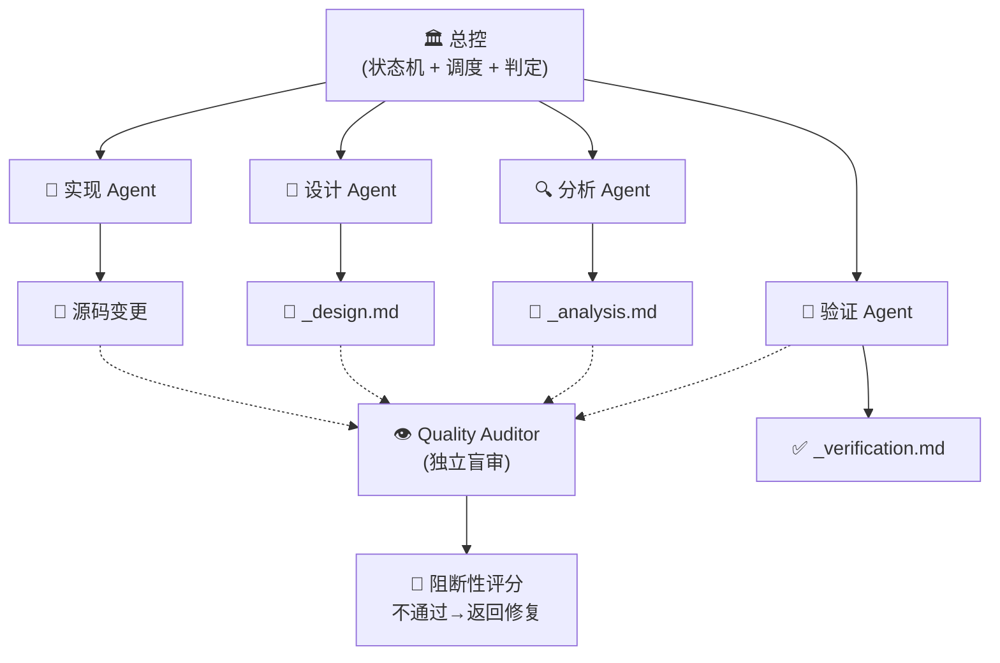

# ReqPlan-v3 — 软件工程全生命周期管理引擎

> 把"从需求到上线"变成一条不会遗漏、不会跳步的流水线。AI 自动推进，中途打断也能接着跑。

[](./SKILL.md)
[](./SKILL.md)
[](#许可证)

---

## 这是什么

你一定经历过这些项目管理噩梦：

- 🔄 **需求改了三版**，代码写了一半发现方向错了，返工到哭
- 📝 **上线了才发现没写文档**，接手的人一脸懵
- ⏸️ **对话被打断 / 电脑关机**，下次回来 AI 已经忘了之前在干嘛
- 🧩 **Bug 修复变成"按下葫芦浮起瓢"**，改好这个又炸了那个
- 🚫 **跳过验证就上线**，质量完全靠运气

**ReqPlan-v3 就是来兜这些底的——它把软件工程变成一条有严格顺序、有质量闸门、有断点续跑的流水线，AI 按阶段自动推进，不会跳步也不会遗漏。**

---

## 核心理念：Harness Engineering

> Harness（马具）→ 给 AI 套上缰绳，让它在正确的轨道上跑，而不是想跑哪跑哪。

| 原则 | 含义 |
|------|------|
| **角色边界** | 每个 Agent 只做一件事：分析 / 设计 / 实现 / 验证 / 审核 |
| **状态机驱动** | 7 阶段严格顺序，不能跳步、不能回溯（除非质量审核打回） |
| **产物契约** | Agent 之间通过文件传递，不靠对话记忆——断了也能接上 |
| **质量闸门** | 每个阶段独立 Quality Auditor 盲审，不通过就打回重做 |
| **接力棒持久化** | `.agent/harness/_baton.md` 记录一切，跨 Session 续跑 |

---

## 核心能力

| 能力 | 说明 |
|------|------|
| **7 阶段自动推进** | START → ANALYZE → CONFIRM → DESIGN → IMPLEMENT → VERIFY → JUDGE → DONE |
| **多 Agent 协作** | Analyzer / Designer / Implementer / Verifier / QA 各司其职 |
| **断点续跑** | 对话中断、电脑关机，下次自动读取接力棒恢复进度 |
| **五层验证体系** | 静态检查 → 单元测试 → 构建集成 → 异常处理 → 流程合规 |
| **独立质量审核** | Quality Auditor 子 Agent 独立盲审，不通过阻断流程 |
| **六维度最终判定** | JUDGE 阶段从架构/代码/运行时/覆盖/安全/文档 六维验收 |
| **用户中断处理** | 支持立即重置 / 记入 TODO / 仅讨论 三种选项 |
| **自绑定审查** | 支持审查和修复 Skill 自身（元任务） |

---

## 快速开始（30 秒入门）

### 方式一：自然语言触发（最推荐）

直接对 AI 说：

> "帮我在 e:/my-app 项目里加一个用户登录功能，用 JWT 鉴权"

→ ReqPlan-v3 自动启动完整项目流程：分析需求 → 生成设计 → 编码实现 → 验证 → 判定。

或者更明确地说：

> "用 ReqPlan 走一遍完整流程，给我在 my-app 里实现文件上传功能"

### 方式二：斜杠命令

```bash
/reqplan start                 # 启动引导，选择流程
/reqplan init                  # 初始化 .agent/harness/ 目录
# 中断后继续——再发一次 /reqplan start 即可自动续跑
```

### 方式三：指定流程类型

| 你想做什么 | 直接说 |
|-----------|--------|
| **新项目从零到验收** | "帮我在 e:/new-project 创建一个博客系统" |
| **修复 Bug** | "帮我修一下 login.ts 里的 Token 过期问题" |
| **重构代码** | "帮我重构 order-service，拆分成微服务" |
| **只做设计评审** | "帮我审查一下这份数据库设计" |
| **补充文档** | "帮我给这个项目补 API 文档" |
| **测试优化** | "帮我给 user-service 加单元测试" |

### 续跑（中断后继续）

```
你："我刚才做到哪了？"
ReqPlan：（读取接力棒）→ 当前在 DESIGN 阶段，需求分析已完成，等待技术设计输出
你："继续"
ReqPlan：自动从 DESIGN 阶段接着跑...
```

---

## 状态机

```
START ──→ ANALYZE ──→ CONFIRM ──→ DESIGN ──→ IMPLEMENT ──→ VERIFY ──→ JUDGE ──→ DONE
            │            │          │           │            │           │
            │   用户确认  │          │           │            │           │
            │  ┌─── YES ─┤          │           │            │           │
            │  │          └──→ ABORT │           │            │           │
            │  │                     │           │            │           │
            ▼  ▼                     ▼           ▼            ▼           ▼
         修改需求              QA 审核      QA 审核       QA 审核     六维最终判定
         (回 ANALYZE)        (打回重做)  (打回重做)   (打回重做)   (打回/通过)
```

| 状态 | 推进方式 | 关键检查点 |
|------|---------|-----------|
| START | 自动 | 创建接力棒 |
| ANALYZE | 自动 | 质量审核阻断 |
| CONFIRM | **等待用户** | 用户确认 / 修改 / 取消 |
| DESIGN | 自动 | 质量审核阻断 |
| IMPLEMENT | 自动 | 质量审核阻断 |
| VERIFY | 自动 | 独立盲审阻断 |
| JUDGE | 自动 | 六维度最终判定 |
| DONE | 终止 | 新任务自动重置为 START |

---

## 多 Agent 协作架构


```mermaid
flowchart TD
    Controller["🏛️ 总控<br>(状态机 + 调度 + 判定)"]
    Analyzer["🔍 分析 Agent"]
    Designer["📐 设计 Agent"]
    Implementer["🔨 实现 Agent"]
    Verifier["🧪 验证 Agent"]
    QA["👁️ Quality Auditor<br>(独立盲审)"]

    Controller --> Analyzer
    Controller --> Designer
    Controller --> Implementer
    Controller --> Verifier
    Analyzer --> A["📄 _analysis.md"]
    Designer --> D["📐 _design.md"]
    Implementer --> I["💾 源码变更"]
    Verifier --> V["✅ _verification.md"]
    Verifier -.-> QA
    A -.-> QA
    D -.-> QA
    I -.-> QA
    QA --> Q["🚦 阻断性评分<br>不通过→返回修复"]
```

**协作流程**：
1. 总控读取接力棒确定当前状态
2. 按状态路由表调度对应的 Agent
3. Agent 读取前置产物，生成当前阶段产物
4. Quality Auditor 审核产物，通过后才能进入下一阶段
5. 总控更新接力棒，自动推进到下一阶段

---

## 适用场景 vs 不适用场景

| ✅ 适用 | ❌ 不适用 |
|---------|----------|
| 新项目从需求到上线（推荐） | 简单问答（直接问 AI 即可） |
| Bug 修复流程化（防止修 A 炸 B） | 单次简单编码任务（改个变量名不需要这么重） |
| 代码重构（需要架构评估） | 生成报表/看板（用 conspect 去） |
| 设计评审（让 AI 独立盲审你的设计） | 生成操作手册（用 ManualGen 去） |
| 中途常被打断的开发任务 | Skill 体检（用 skill-medic 去） |
| 需要严格质量闸门的项目 | — |

---

## 产物结构

```
{项目路径}/.agent/harness/
├── _baton.md                     # 🥎 接力棒（状态 + 进度 + 任务追踪）
├── _analysis.md                  # 需求分析报告
├── _design.md                    # 技术设计文档
├── _implementation.md            # 实现摘要
├── _verification.md              # 验证报告
├── _quality_audit_analysis.md    # 分析质量审核报告
├── _quality_audit_design.md      # 设计质量审核报告
├── _quality_audit_implement.md   # 实现质量审核报告
├── _quality_audit_verify.md      # 验证质量审核报告
└── _quality_audit_judge.md       # 最终全局判定报告
```

**接力棒是核心**：任何时候你发一句"进度"，AI 读接力棒就能告诉你：
- 当前在哪个阶段
- 上一个阶段产出了什么
- 下一步要做什么
- 有没有打回过、为什么

---

## 项目结构

```
ReqPlan-v3/
├── SKILL.md                   # 技能入口（唯一版本声明源）
├── SKILL-execution.md         # 核心执行指南
├── README.md                  # 本文件
├── 6-docs/
│   └── changelog.md          # 版本变更日志
├── agents/                    # Agent 定义
│   ├── analyzer-agent.md
│   ├── designer-agent.md
│   ├── implementer-agent.md
│   ├── verifier-agent.md
│   └── quality-auditor-agent.md
├── quality-control/           # 质量体系
│   └── 00-quality-system.md
├── protocols/
│   └── baton-protocol.md     # 接力棒协议
├── artifacts/
│   └── template-artifacts.md
├── SKILL.chunks/              # 分块按需加载
├── reference/
│   ├── anti-patterns.md
│   ├── debug-guide.md
│   └── faq-deep.md
└── legacy/                    # 历史归档
```

---

## 五层验证体系

| 层级 | 验证内容 | 说明 |
|------|----------|------|
| Layer 1 | 静态检查 | 代码规范、类型检查、文件完整性 |
| Layer 2 | 单元测试 | 核心函数正确性、边界条件、错误路径 |
| Layer 3 | 构建集成 | 编译检查、依赖安装、构建输出 |
| Layer 4 | 异常处理 | 失败重试、回滚策略、降级行为 |
| Layer 5 | 流程合规 | 链路记录、决策日志、约束登记 |

---

## 设计理念参考

- [Harness Engineering 文章](https://mp.weixin.qq.com/s/AFX_qsyAPBRYyqEV365O9Q)
- [testerhome Harness 设计](https://testerhome.com/articles/44066)

---

## 许可证

MIT
