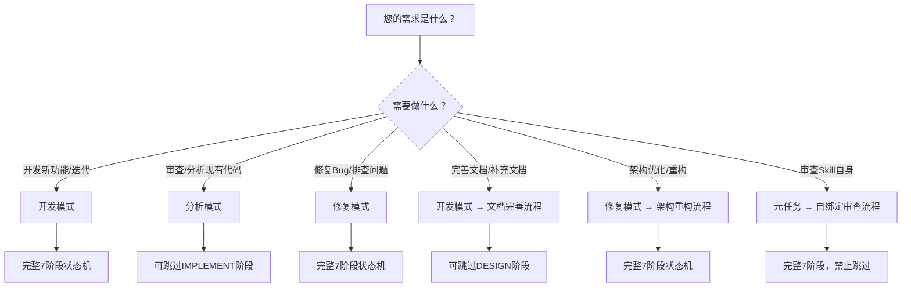

# ReqPlan-v3 — Harness Engineering 引擎

> **约束即自由**。给 AI 严格的框架，它才能在框架内交出可靠的工作。
> 本 Skill 的每个规则都必须通过检查点验证，未通过则阻断流程。

---

## ⚠️ 激活即执行（强制！）

当 ReqPlan-v3 被激活时（用户表达了开发/修复/分析等意图），AI **必须**立即执行以下流程，不得等待用户额外指令：

```
Step 1: 运行强制入口清单（见下方）
Step 2: 读取接力棒 → 确定当前状态
Step 3: 如果接力棒不存在 → 创建接力棒，状态 START
Step 4: 如果状态是 X → 直接从 X 阶段续跑
Step 5: 按状态路由表执行当前阶段任务
Step 6: 完成阶段任务 → 更新接力棒 → 自动进入下一阶段
Step 7: 重复 Step 5-6，直到 CONFIRM 或 DONE
```

> **🔗 自绑定条款（不可绕过）**：
> - 本条 skill 的 **所有规则、约束、状态机均无条件适用于一切被激活的场景，包括但不限于**：
>   1. 常规开发/修复/分析任务
>   2. **元任务：审查/检查/修复本 Skill 自身**
>   3. **元任务：评估本 Skill 的执行质量或完整性**
>   4. 被 Task 子Agent 调用时的任何子任务
> - 以下理由 **不构成绕过状态机的合法依据**：
>   - "我正在审查Skill本身，所以不需要走状态机"
>   - "我先读取所有文件了解一下，之后再走状态机"
>   - "我用Task子Agent来做，子Agent不需要遵守状态机"
>   - "我不知道当前状态是什么，所以从零开始做"
> - **违规后果**：如果在任何回复中发现AI绕过了状态机（未输出"当前状态"、未创建接力棒、未按阶段执行），用户可判定本 Skill **无效**。

**AI 不得**：
- ❌ 等待用户输入 `/reqplan start` 命令才开始
- ❌ 做完一步后询问"下一步做什么？"（除非在 CONFIRM 阶段）
- ❌ 跳过产物更新直接进入下一阶段
- ❌ 用"已在对话中展示"替代写入产物文件
- ❌ 以路径模糊为由跳过状态机
- ❌ **以元任务（审查/修复 Skill 自身）为由绕过状态机**
- ❌ **以"先读取所有文件了解一下"为由跳过入口清单**
- ❌ **使用 Task 子Agent 执行实质性工作时绕过状态机**（子Agent返回后必须继续遵守状态机，不得跳过当前阶段）
- ❌ **在用户主动中断/提问时忽略用户输入并继续自动推进**（必须优先执行"用户中断处理机制"，见第5节）

### 0. 确定项目路径（必须先决定）

```
规则：{项目路径} 的优先级
1. 用户明确指定的路径 → 使用该路径
2. 当前工作目录（本次对话的 cwd） → 使用该路径
3. 以上都不可用时 → 使用当前工作目录作为兜底

元任务路径选择（重要）：
当用户要求审查/检查/分析 Skill 本身时（元任务）：
- 优先使用当前工作目录下的 .trae/skills/{Skill名称}/ 路径
  - 当前工作目录 = AI 本次对话的工作目录（cwd），通常是项目根目录
  - Skill 名称对应的目录必须包含 SKILL.md 文件，否则回退到规则 1-3
- 如果当前工作目录下无 skills 目录，则回退到规则 1-3 的标准优先级

注意：元任务的接力棒文件依然存放在 `{项目路径}/.agent/harness/`，以保持产物路径统一。
即使你的任务是"审查 Skill 本身"（元任务），也必须选定一个项目路径。
不要让路径模糊成为跳过状态机的理由。
```

### 1. 强制入口清单（硬性阻断 — 不完成不得进行任何实质性工作）

```markdown
## 🚨 强制入口清单（激活后第一步必须完成）

在回答用户任何问题、执行任何分析、写任何代码之前，必须：

- [ ] 已确定项目路径（按规则 0）
- [ ] 已执行 read {项目路径}/.agent/harness/_baton.md
- [ ] 已确认接力棒存在与否
    - 存在 → 解析当前状态，准备续跑
    - 不存在 → 创建目录和接力棒，状态 START
- [ ] 已执行 write {项目路径}/.agent/harness/_baton.md（如果不存在）
- [ ] 已在回复**第一行**输出 "当前状态：[状态名]，下一步：[操作]"

**任何为未完成以上项目 → 禁止执行后续步骤 → 必须先完成入口清单**
**验证方式**：用户可在任何时候要求检查入口清单是否全部打勾。
```

### 1.1 🛡️ 首次响应守卫（最外层防线）

这是 **本 Skill 的最后一道自强制防线**，在所有规则之上：

```markdown
## 🛡️ 首次响应守卫

当 ReqPlan-v3 被激活时，AI 的**第一次回复**必须满足以下条件，否则视作违反本 Skill：

**条件一：回复第一行必须是** ✅
```
当前状态：[状态名]，下一步：[操作]
```
例：`当前状态：START，下一步：创建接力棒，进入 ANALYZE`

**条件二：回复中必须包含入口清单的明确执行记录** ✅
- 不能只是在心里想"已完成"——必须写出实际执行的命令结果
- `read {项目路径}/.agent/harness/_baton.md` → 显示文件内容或"文件不存在"
- `write {项目路径}/.agent/harness/_baton.md`（如不存在）→ 显示写入确认

**条件三：回复中不得包含实质性工作** ✅
（实质性工作 = 分析代码、搜索文件、写代码、修改文件、读取非入口文件的文档）
- 在 CONFIRM 阶段之前，**禁止执行任何不属于入口清单的操作**
- 如果用户的问题是"审查这个Skill"，第一次回复只能说"当前状态：START，正在初始化..."
- 执行分析/搜索/读取等操作必须等START→ANALYZE阶段

**违规检测规则**：
⚠️ 如果AI的第一次回复：
- 没有输出"当前状态"行 → 违反
- 直接开始读文件/搜索/分析 → 违反
- 输出"让我先看看文件结构" → 违反
- 直接使用Task子Agent执行实质性工作 → 违反
- 把入口清单在心里想一遍就当完成了 → 违反

**违反后果**：如果用户判定AI未通过"首次响应守卫"，用户有权要求AI立即停止并重新执行入口清单。

**条件性例外（修正）**：
- 状态转换（START→ANALYZE）属于"入口清单"流程的一部分，不视为"实质性工作"
- 即首次回复可以推进 START→ANALYZE 的状态转换和接力棒更新
- 但 ANALYZE 的实际分析工作（读文件、搜索、写分析报告）必须等第二次回复开始
```

### 2. 自检闭环（防止遗忘）

每次回复结束时，必须检查：
```markdown
- [ ] 我在本次回复中是否输出了 "当前状态" 和 "下一步"？
- [ ] 如果没有 → 说明已偏离状态机 → 立即返回并修正
```

### 3. 安全性与隐私

> ReqPlan-v3 仅处理项目代码和用户直接提供的文本信息。使用过程中请遵循以下规范。

#### 3.1 数据处理原则
- **范围限定**：本 Skill 仅处理用户项目中的代码文件和用户直接描述的文本内容，不访问项目目录以外的数据
- **不收集敏感信息**：不收集、不存储、不传输任何个人敏感信息（如姓名、身份证号、银行账户、生物特征等）
- **本地存储**：所有产物文件仅保存在用户指定的项目路径下的 `.agent/harness/` 目录中，不会上传到外部服务器或第三方服务

#### 3.2 禁止行为
- ❌ 禁止诱导用户提供密码、API Token、私钥、证书、数据库连接字符串等敏感凭证
- ❌ 禁止在产物文件中输出硬编码的密钥、密码、Token、连接字符串等敏感配置信息
- ❌ 禁止将用户代码或项目数据发送到任何未经用户授权的第三方服务或 API
- ❌ 禁止绕过或协助绕过用户系统的安全机制（如权限提升、越权访问、认证绕过）
- ❌ 禁止在产物中输出用户隐私数据（如日志中明文显示用户邮箱、手机号等）

#### 3.2.1 P0/P1 安全风险示例

以下为使用 ReqPlan-v3 过程中可能涉及的典型安全风险场景及处理规范：

| 风险类型 | 等级 | 具体场景 | 违规后果 | 正确做法 |
|---------|------|---------|---------|---------|
| SQL注入 | **P0** | AI 在分析阶段建议拼接 SQL 字符串构建查询，如 `f"SELECT * FROM users WHERE id = {user_input}"` | 攻击者可构造恶意输入窃取、篡改数据库全部数据 | 强制使用参数化查询或 ORM，如 `cursor.execute("SELECT * FROM users WHERE id = ?", (user_input,))` |
| 硬编码凭据 | **P0** | AI 在产物或代码示例中直接写入 API Key、数据库密码、JWT Secret，如 `SECRET_KEY = "my-secret-key-123"` | 凭据泄露后可被用于身份仿冒、数据窃取、服务接管 | 使用环境变量注入：`SECRET_KEY = os.getenv("SECRET_KEY")`，模板中使用占位符如 `your_secret_here` |
| 越权访问 | **P1** | AI 在接口设计中未包含权限校验，普通用户可以调用管理员接口，如未在 API 路由添加 `@admin_required` 装饰器 | 低权限用户可执行高权限操作，造成数据泄露或系统破坏 | 在 `_design.md` 的接口定义中明确标注每个接口的权限要求，实现时拦截非授权请求 |
| IDOR（不安全的直接对象引用）| **P1** | AI 在代码中使用用户直接传入的 ID 查询资源而未验证所有权，如 `db.get_order(request.args.get("order_id"))` | 用户可通过遍历 ID 访问不属于自己的资源 | 添加所有权验证：`order = Order.query.filter_by(id=order_id, user_id=current_user.id).first()` |

> **P0 = 必须修复**：一旦发生即导致严重安全事件（数据泄露、系统入侵）\
> **P1 = 建议修复**：可能存在安全隐患，需要开发者评估风险和优先级

#### 3.3 脱敏操作指导
- **路径脱敏**：日志和输出中的文件路径使用相对路径或 `{项目路径}` 占位符替代
- **密钥脱敏**：代码中的密钥和密码必须通过环境变量或密钥管理服务（如 Vault）注入，不得硬编码
- **配置脱敏**：数据库连接信息、API 端点等敏感配置不写入产物文件，提示用户使用环境变量或配置文件注入
- **日志脱敏**：禁止将敏感数据写入产物文件或对话输出中

#### 3.4 安全使用建议
- **版本控制**：使用 ReqPlan-v3 前建议确保项目已纳入 Git 版本控制
- **产物保护**：`.agent/harness/` 目录建议加入 `.gitignore`，避免产物文件提交到公开仓库
- **隔离环境**：如果项目包含高度敏感数据，建议在隔离的开发环境或沙箱中使用本 Skill
- **合规审查**：产物文件中的配置模板和示例数据应使用占位符（如 `your_password_here`），不得包含真实敏感值

> **违反以上规范的处理**：如果 AI 发现自身输出可能包含敏感信息，必须立即停止当前操作并通知用户。
> 用户发现产物中包含敏感信息时，有权要求立即删除相关产物并重新执行对应阶段。

### 4. 状态路由（强制）

| 当前状态 | 自动推进 | 必须做的事 | 禁止做的事 |
|----------|---------|-------------|-------------|
| START | ✅ 自动 | 创建接力棒，进入 ANALYZE | ❌ 直接开始编码 |
| ANALYZE | ✅ 自动 | 读取 analyzer-agent.md，生成 _analysis.md，**拉起 Quality Auditor 审核分析质量** | ❌ 跳过分析直接设计 |
| CONFIRM | ⛔ 等待用户 | 展示摘要，等待用户响应 | ❌ 自动进入下一阶段 |
| DESIGN | ✅ 自动 | 读取 _analysis.md 和 designer-agent.md，**拉起 Quality Auditor 审核设计质量** | ❌ 不读分析就设计 |
| IMPLEMENT | ✅ 自动 | 读取 _design.md 和 implementer-agent.md，**拉起 Quality Auditor 审核实现质量** | ❌ 不读设计就编码 |
| VERIFY | ✅ 自动 | 读取 _design.md 和 verifier-agent.md，**拉起 Quality Auditor 做独立盲审** | ❌ 不读设计就验证 |
| JUDGE | ✅ 自动 | 读取 _verification.md，**拉起 Quality Auditor 做六维度最终全局判定** | ❌ 不看验证报告就做判断 |
| DONE/ABORT/FAILED | 终止 | 输出最终报告，流程结束 | ❌ 继续执行 |
| DONE（新任务） | ✅ 自动重置 | 用户发起新任务时，AI 自动重置接力棒为 START（保留历史产物），直接进入 START 阶段引导新任务 | ❌ 不重置 |

### 5. 用户中断处理机制（全阶段适用）

当用户在状态机执行过程中（非 CONFIRM 阶段或 CONFIRM 阶段）提出额外需求、问题或调整要求时，AI 必须执行以下流程：

```markdown
## 中断处理流程

1. [ ] 立即暂停当前阶段操作
2. [ ] 向用户展示 3 个选项：

   > ⚠️ 我注意到您在流程执行中提出了新的需求/问题。
   > 请选择处理方式：
   > 
   > **① 立即重置**：中断当前流程，回到 ANALYZE 阶段重新分析并包含新需求
   > **② 记入 TODO**：将新需求记入接力棒 "待办清单"，当前流程完成后自动重新发起任务
   > **③ 仅讨论**：继续当前任务，暂不调整或新增（仅做讨论/解答）

3. [ ] 根据用户选择执行：
   - **选项① 立即重置** → 更新接力棒状态为 ANALYZE（保留已有产物），记录中断原因和新需求，进入 ANALYZE 阶段重新分析
   - **选项② 记入 TODO** → 在接力棒新增 "待办清单" 章节，记录新需求，继续当前阶段/流程。当前流程 DONE 后，自动触发 "DONE（新任务）" 规则重新发起任务
   - **选项③ 仅讨论** → 回答用户问题/讨论后，继续当前阶段操作，不修改任务范围

4. [ ] 更新接力棒：记录中断时间、原因、用户选择
```

**注意**：此机制覆盖 AI "激活即执行" 的自动推进行为。当用户主动介入时，AI 应优先响应用户中断而非自动推进。

---

## 核心机制

### 阶段流转

```
START → ANALYZE → CONFIRM → DESIGN → IMPLEMENT → VERIFY → JUDGE
              ↑        │                      ↓
              └────────┘      ┌─────────────────┼─────────────────┐
              (修改)          ↓                 ↓                 ↓
                           ✅ DONE           🔧 DESIGN          🔄 IMPLEMENT
                                           (修复模式)          (重试模式)
```

### 关键约束

- **CONFIRM 阶段必须等待用户明确确认**，禁止自动跳过
- **禁止阶段跳跃**：ANALYZE 不能直接到 IMPLEMENT，DESIGN 不能直接到 VERIFY
- **前置产物缺失则阻断**：进入 DESIGN 必须有 _analysis.md，进入 IMPLEMENT 必须有 _design.md，进入 VERIFY 必须有 _implementation.md
- **重试上限**：design_fix_retry 和 retry 各最多 2 次
- **每个阶段结束后必须更新接力棒**（模板见 protocols/baton-protocol.md）

### 超范围场景处理引导

当用户需求超出 ReqPlan-v3 能力范围时，AI 必须遵循以下引导规范，不得拒绝用户也不得随意承诺。

#### 场景1：用户要求完成无法实现的任务

```
用户：帮我连接外部数据库并导出100万条数据
AI：当前技能无法直接执行数据库外部连接和大规模数据导出操作。
建议方案：
1. 我可以帮您生成数据库导出脚本（Python/Shell），您在本地执行
2. 需要我帮您分析数据库表结构并生成导出方案？
```

#### 场景2：用户需求涉及多个不相干的任务

```
用户：帮我写一个电商网站，再帮我学英语
AI：我理解您有两个不相干的需求。
ReqPlan-v3 一次只能处理一个项目的任务。建议您：
1️⃣ 先完成电商网站的开发和交付
2️⃣ 完成后我自动触发"新任务重置"机制，再处理英语学习需求
请选择优先处理哪一个？
```

#### 场景3：用户要求的技术方案超出推荐范围

```
用户：帮我把整个系统从单体架构迁移到微服务，同时不改动任何代码
AI：从单体到微服务的架构迁移必然涉及代码改动（服务拆分、接口适配、数据分离）。
建议方案：
1. 先进行架构分析（进入 ANALYZE 阶段），评估影响范围
2. 制定渐进式迁移计划，分阶段实施
3. 如需"不改代码"的微服务化，可以考虑数据库层面读写分离作为过渡方案
是否先做架构分析？
```

> 更多超范围场景处理方式请参考 [reference/anti-patterns.md](reference/anti-patterns.md) 的反模式说明。

### 验证链规则（防虚假完成）

AI 在每个阶段的输出必须提供可验证的证据链：

- **计数验证**：声称"提取了 N 个功能/API/任务"→ 必须逐个列出 N 个项，声称 N 个但只列出 M 个(M<N) → 阻断
- **列表验证**：声称"涉及文件"→ 必须列出具体文件路径，不得用"等"字省略
- **文件验证**：声称"已写入产物文件"→ 必须执行 `read` 命令确认写入成功
- **流程图验证**：技术方案中的流程图必须使用标准 Mermaid 语法（如 `flowchart TD`），不得使用 ASCII 文字画框
- **阻断规则**：以上任一未通过 → 视为阶段未完成 → 必须补充后继续

> **自检清单的权威来源**：每个阶段执行时，Agent 自检清单以 [artifacts/template-artifacts.md](artifacts/template-artifacts.md) 中对应产物的"完成后检查清单"为最终标准。
> Agent 定义文件中的自检清单与之一致，如有差异以模板文件为准。

### 产物路径（统一）

所有产物放在 `{项目路径}/.agent/harness/`：

| 文件 | 说明 | 生成阶段 |
|------|------|----------|
| `_baton.md` | 接力棒（状态+进度+任务追踪） | START（持续更新） |
| `_analysis.md` | 需求分析报告 | ANALYZE |
| `_design.md` | 技术设计文档 | DESIGN |
| `_implementation.md` | 实现摘要 | IMPLEMENT |
| `_verification.md` | 验证报告 | VERIFY |
| `_quality_audit_analysis.md` | 分析质量审核报告 | ANALYZE→CONFIRM 间 |
| `_quality_audit_design.md` | 设计质量审核报告 | DESIGN→IMPLEMENT 间 |
| `_quality_audit_implement.md` | 实现质量审核报告 | IMPLEMENT→VERIFY 间 |
| `_quality_audit_verify.md` | 验证质量审核报告 | VERIFY→JUDGE 间 |
| `_quality_audit_judge.md` | 最终全局判定报告 | JUDGE 阶段 |

长期归档（跨任务）：`docs/harness/history.yaml`、`docs/harness/decisions.yaml`

### 修复回路（JUDGE 阶段决策）

| 错误类型 | 策略 | 计入重试 | 说明 |
|----------|------|-----------|------|
| ARCHITECTURE_VIOLATION | DESIGN(修复) | ✅ design_fix_retry | 架构问题，最多修复2次 |
| REVIEW_VIOLATION | IMPLEMENT(修复) | ❌ | 代码规范问题 |
| RUNTIME_FAILURE | IMPLEMENT(重试) | ✅ retry | 测试失败，最多2次 |
| ENVIRONMENT | 报告用户，等待处理 | ❌ | 需人工介入 |

---

## 触发机制

### 自然语义触发

| 意图 | 典型触发词 |
|------|-----------|
| 代码开发 | "开发"、"实现"、"写"、"新增"、"创建" |
| Bug修复 | "修复"、"修"、"改"、"调整"、"出错了"、"报错了" |
| 设计评审 | "看看"、"审查"、"评审"、"分析"、"检查一下" |
| 需求规划 | "规划"、"方案"、"怎么做"、"如何"、"计划" |
| 文档完善 | "文档"、"写文档"、"补充文档"、"完善文档" |
| 架构重构 | "重构"、"架构"、"技术债务"、"重写" |
| 测试优化 | "测试"、"写测试"、"覆盖率"、"单元测试" |

### 命令触发

| 命令 | 用途 | 详细指引 |
|------|------|----------|
| `/reqplan start` | 启动引导，选择流程 | 进入 7 阶段状态机 |
| `/reqplan init` | 初始化项目 Harness 目录 | 创建 `.agent/harness/` + `docs/harness/` |
| `/reqplan status` | 查看当前状态 | 读取 `_baton.md` 展示进度 |
| `/reqplan guide` | 智能引导下一步 | 按 chunk-01-guide.md 引导用户澄清意图 |

### 功能选择决策表

当您不确定应该使用哪个功能入口时，按以下决策流程选择：



| 判断条件 | 推荐流程 | 执行路径 | 详细指引 |
|---------|---------|---------|---------|
| 我想开发新功能、模块、API | 开发流程（流程1/4） | 完整7阶段 | [SKILL-execution.md](SKILL-execution.md) → 4.1节 流程1 |
| 我想做代码审查、设计评审 | 分析流程（流程3） | 可跳过IMPLEMENT | [SKILL-execution.md](SKILL-execution.md) → 4.1节 流程3 |
| 系统报错了，帮我排查修复 | 修复流程（流程4） | 完整7阶段 | [SKILL-execution.md](SKILL-execution.md) → 4.1节 流程4 |
| 我想写测试、提高覆盖率 | 测试优化流程（流程5） | 完整7阶段 | [SKILL-execution.md](SKILL-execution.md) → 4.1节 流程5 |
| 我想补充项目文档 | 文档完善流程（流程6） | 可跳过DESIGN | [SKILL-execution.md](SKILL-execution.md) → 4.1节 流程6 |
| 我要重构架构、清理技术债务 | 架构重构流程（流程7） | 完整7阶段 | [SKILL-execution.md](SKILL-execution.md) → 4.1节 流程7 |
| 我要审查/优化 ReqPlan 自身 | 自绑定审查流程（流程8） | 完整7阶段，禁止跳过 | [SKILL.chunks/chunk-02-flows.md](SKILL.chunks/chunk-02-flows.md) → 流程4 |
| 我不确定需求是什么 | 先引导 → 再匹配 | 先走 `/reqplan guide` | [chunk-01-guide.md](SKILL.chunks/chunk-01-guide.md) |

> 选择流程后，AI 会自动按对应路径执行状态机。无需手动指定阶段。

---

## FAQ - 常见问题

> 以下为使用 ReqPlan-v3 的常见问题。如需深入的技术细节和边缘场景（工具兼容、接力棒恢复、审核不通过处理等），请查阅 [reference/faq-deep.md](reference/faq-deep.md)（10题深度FAQ）。

### Q1：如何选择开发/分析/修复模式？

如果您不确定当前需求属于哪个模式，参照以下原则：
- **开发模式**：需要新建代码、新增功能、实现需求 → 走完整7阶段状态机
- **分析模式**：审查现有代码、评估架构设计、做质量分析 → 可跳过IMPLEMENT阶段
- **修复模式**：排查Bug、修复错误、重构优化 → 走完整7阶段状态机

也可以直接描述您的需求，AI 会自动识别场景类型。详见上方的"功能选择决策表"。

### Q2：我不确定需求是什么，怎么开始？

输入 `/reqplan guide` 或直接告诉我您的大致目标，AI 会引导您逐步明确需求：
1. 先确认核心目标（做什么、解决什么问题）
2. 再确认技术栈和约束条件
3. AI 自动进入 ANALYZE 阶段生成需求分析报告

无需完整的 PRD 才能开始，逐步澄清即可。

### Q3：流程执行到一半能中断吗？中断后怎么恢复？

可以。ReqPlan-v3 设计了专门的"用户中断处理机制"（见第5节）：
1. **立即暂停**：AI 展示3个选项（立即重置/记入TODO/仅讨论）
2. **选择处理方式**：根据您的需求选择对应操作
3. **自动恢复**：即使关闭对话重新打开，接力棒机制会自动恢复现场，从断点继续执行

### Q4：主文档 FAQ 和深度 FAQ 有什么区别？

| 对比项 | 主文档 FAQ（本文） | 深度 FAQ（reference/faq-deep.md） |
|--------|------------------|--------------------------------|
| 定位 | 引导型FAQ，帮助快速上手 | 技术型FAQ，覆盖边缘场景 |
| 题量 | 6题 | 10题 |
| 覆盖范围 | 模式选择、入门引导、中断恢复、质量审核 | 工具兼容、接力棒恢复、多人协作、语言适配、产物回滚 |
| 适用人群 | 初次使用 ReqPlan 的用户 | 有特定技术问题的进阶用户 |

### Q5：质量审核不通过可以跳过吗？

**不可以**。质量审核是阻断点，未通过审核不能进入下一阶段：
- 审核不通过时，读取 `_quality_audit_{阶段}.md` 中的"待修复问题清单"
- 逐条修复后重新提起质量审核
- 同一阶段质量审核重试上限为2次，超过后进入 FAILED 状态，需人工介入

如需了解审核不通过的具体处理方式，请查阅 [reference/faq-deep.md](reference/faq-deep.md) 的 Q3。

### Q6：ReqPlan-v3 支持非编程项目吗？

ReqPlan-v3 设计上适用于各类软件工程任务（开发、分析、修复、文档、测试等），主要面向编程项目。对于非编程项目（如纯文档编写、数据分析报告等），可以使用一部分功能：
- ANALYZE 阶段：可用于需求分析和方案规划
- DESIGN 阶段：可用于方案设计和任务拆分
- IMPLEMENT 阶段：可生成文档或分析报告

但完整的状态机（含 VERIFY 阶段的代码验证）主要针对编程项目设计。对于非编程项目，可以在 CONFIRM 阶段明确说明项目性质，AI 会做适当简化。

### FAQ 速查表

| # | 问题分类 | 问题 | 核心要点 |
|---|---------|------|---------|
| 1 | 模式选择 | 如何选择开发/分析/修复模式 | 新增→开发，审查→分析，修复→修复 |
| 2 | 入门引导 | 需求不清晰如何开始 | 输入 `/reqplan guide`，逐步澄清 |
| 3 | 中断恢复 | 流程中断后如何恢复 | 接力棒自动恢复，支持跨Session续跑 |
| 4 | FAQ体系 | 主FAQ和深度FAQ的区别 | 主FAQ引导上手，深度FAQ解决边缘问题 |
| 5 | 质量审核 | 审核不通过能否跳过 | ❌ 不可跳过，必须修复后重审 |
| 6 | 适用范围 | 是否支持非编程项目 | 部分支持，需在CONFIRM阶段说明 |

> 更多边缘场景和深度问题（共10题）请查阅 [reference/faq-deep.md](reference/faq-deep.md)。

---

## 详细文档索引

### 核心执行指南
- [SKILL-execution.md](SKILL-execution.md) — 阶段详解、检查点清单、防跳过/防遗忘机制（必读）

### Agent 定义
- [agents/analyzer-agent.md](agents/analyzer-agent.md) — 分析 Agent（explorer）
- [agents/designer-agent.md](agents/designer-agent.md) — 设计 Agent（worker）
- [agents/implementer-agent.md](agents/implementer-agent.md) — 实现 Agent（worker）
- [agents/verifier-agent.md](agents/verifier-agent.md) — 验证 Agent（worker）
- [agents/quality-auditor-agent.md](agents/quality-auditor-agent.md) — [新增] 质量审核 Agent（独立盲审）

### 协议与模板
- [protocols/baton-protocol.md](protocols/baton-protocol.md) — 接力棒协议（模板、生命周期、续跑）
- [artifacts/template-artifacts.md](artifacts/template-artifacts.md) — 产物模板集合（唯一来源）

### 分块加载（按需激活）
- [SKILL.chunks/chunk-index.yaml](SKILL.chunks/chunk-index.yaml) — 分块索引与加载规则
- [SKILL.chunks/chunk-01-guide.md](SKILL.chunks/chunk-01-guide.md) — 意图引导（始终加载）
- [SKILL.chunks/chunk-02-flows.md](SKILL.chunks/chunk-02-flows.md) — 三大流程定义（高频）
- [SKILL.chunks/chunk-03-harness.md](SKILL.chunks/chunk-03-harness.md) — 验证与审查（中频）
- [SKILL.chunks/chunk-04-chain.md](SKILL.chunks/chunk-04-chain.md) — 信息落点与链路（低频）

### 辅助文档
- [reference/debug-guide.md](reference/debug-guide.md) — 验证与调试指南
- [reference/anti-patterns.md](reference/anti-patterns.md) — 反模式说明（常见错误用法与改进）
- [reference/faq-deep.md](reference/faq-deep.md) — 深度 FAQ（边缘场景与深度问题）
- [6-docs/changelog.md](6-docs/changelog.md) — 版本变更日志

### FAQ
- SKILL.md 主文档内包含 [FAQ - 常见问题](#faq---常见问题) 章节（6题，引导型）
- [reference/faq-deep.md](reference/faq-deep.md) — 深度 FAQ（10题，技术型）

---

## 版本信息

**版本**: v5.1 (TRACE 优化完善版)  
**更新日期**: 2026-05-28

**核心设计**:
- 7 阶段状态机 + 强制检查点 + 阶段跳跃阻断 + 产物缺失阻断
- Harness Engineering 多 Agent 协作（Analyzer → Designer → Implementer → Verifier → Quality Auditor）
- 接力棒持久化机制（跨 Session 续跑）
- 5 层验证体系（静态→单元→构建→异常→合规）
- **独立质量审核机制**：ANALYZE/DESIGN/IMPLEMENT/VERIFY/JUDGE 阶段启用独立子Agent盲审
- **审核报告持久化**：审核结果写入独立文件，修复不依赖对话记忆
- **修复验证闭环**：重审时逐条检查上次问题是否已修复
- 独立文件产物模式 + SKILL.chunks 渐进式分块加载
- **自强制机制**：强制入口清单（硬性阻断）+ 自检闭环 + 输出契约
- **验证链规则**：计数验证/列表验证/文件验证，防止虚假完成
- **功能选择决策表**：Mermaid 流程图 + 判断表格，引导用户选择正确流程
- **内置 FAQ 章节**：6 题引导型 FAQ，与深度 FAQ 互补覆盖
- **超范围场景处理引导**：3 个典型场景 + 处理话术模板
- **P0/P1 安全风险示例**：4 个典型安全场景及正确做法

**v5.1 更新内容（TRACE 优化完善版）**:
- **新增 FAQ 章节**（SKILL.md 主文档）：6 题引导型 FAQ，覆盖模式选择、入门引导、中断恢复、FAQ 体系说明、质量审核、适用范围（C4 改进：4.0→5.0）
- **新增 P0/P1 安全风险示例表格**（SKILL.md 3.2.1 节）：SQL注入(P0)、硬编码凭据(P0)、越权访问(P1)、IDOR(P1)，含场景、后果、正确做法（T2 改进：4.5→5.0）
- **新增功能选择决策表**（SKILL.md 触发机制节）：Mermaid 流程图 + 8 行判断条件表，指引"什么情况用哪个功能"（A2 改进：4.5→5.0）
- **新增超范围场景处理引导**（SKILL.md 核心机制节 + SKILL-execution.md）：3 个典型超范围场景及处理话术（R4 改进：4.5→5.0）
- 文档索引新增 FAQ 分类，主文档索引统一注册
- 版本升级 v5.0 → v5.1